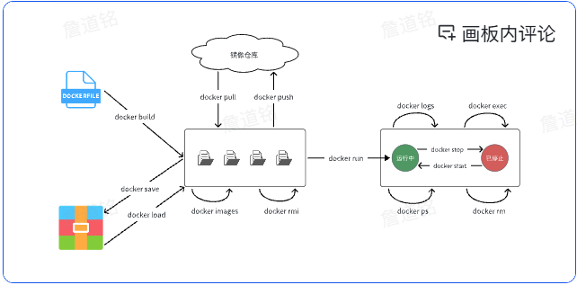
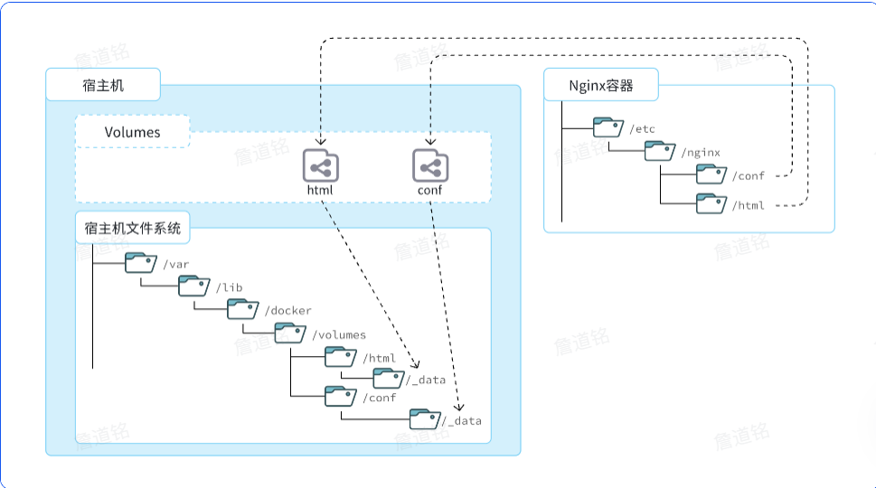

### Docker

#### 1. Docker常见命令

- **docker pull**:拉取镜像
- **docker push**:推送镜像到DockerRegistry
- **docker images**:查看本地镜像
- **docker rmi**:删除本地镜像
- **docker run**:创建并运行容器（不能重复创建）
- **docker stop**:停止指定容器
- **docker start**:启动指定容器
- **docker restart**:重新启动容器
- **docker rm**:删除指定容器
- **docker rm -f**:强制删除
- **docker ps**:查看容器
- **docker logs**:查看容器运行日志
- **docker exec**:进入容器
- **docer save**:保存镜像到本地压缩文件
- **docker load**:加载本地压缩文件到镜像
- **docker inspect**:查看容器详细信息

-------------------------------------------------------
- **docker run -d** ：创建并运行一个容器，-d则是让容器以后台进程运行
- **-p 宿主机端口**:容器内端口，示例中就是将宿主机的3306映射到容器内的3306端口
- **--name mysql**  : 给容器起个名字叫mysql，你可以叫别的
- **-e TZ=Asia/Shanghai** : 配置容器内进程运行时的一些参数
  - 格式：-e KEY=VALUE，KEY和VALUE都由容器内进程决定
  - 案例中，TZ=Asia/Shanghai是设置时区；MYSQL_ROOT_PASSWORD=123是设置MySQL默认密码
- **mysql** : 设置镜像名称，Docker会根据这个名字搜索并下载镜像
  - 格式：REPOSITORY:TAG，例如mysql:8.0，其中REPOSITORY可以理解为镜像名，TAG是版本号
  - 在未指定TAG的情况下，默认是最新版本，也就是mysql:latest 

#### 2. 数据卷

- **概念**：数据卷（volume）是一个虚拟目录，是容器内目录与宿主机目录之间映射的桥梁。它将宿主机目录映射到容器内目录，方便我们操作容器内文件，或者方便迁移容器产生的数据
- **挂载**：宿主机文件系统中的目录通过数据卷相关联的目录与容器中的目录关联起来。即宿主机文件目录通过数据卷相应目录与容器内相关目录相联系。
- /var/lib/docker/volumes这个目录就是默认的存放所有容器数据卷的目录，其下再根据数据卷名称创建新目录，格式为/数据卷名/_data。
- **为什么不让容器目录直接指向宿主机目录呢？**
  - 因为直接指向宿主机目录就与宿主机**强耦合**了，如果**切换了环境**，宿主机目录就可能发生改变了。由于**容器一旦创建，目录挂载就无法修改**，这样容器就无法正常工作了。
  - 但是容器指向数据卷，一个逻辑名称，而数据卷再指向宿主机目录，就不存在强耦合。如果宿主机目录发生改变，只要改变数据卷与宿主机目录之间的映射关系即可。
- 数据卷的相关命令：
  - **docker volume create**：创建数据卷
  - **docker volume ls**：查看所有数据卷
  - **docker volume rm**：删除指定数据卷
  - **docker volume inspect**：查看某个数据卷的详情
  - **docker volume prune**：清除数据卷
- **如何挂载数据卷**：
  - 容器与数据卷的挂载要在创建容器时配置，对于**创建好的容器，是不能设置数据卷**的。
  - 而且创建容器的过程中，发现挂载的数据卷不存在时，数据卷会**自动**创建。
- **挂载本地目录或文件**：
  - **挂载本地目录**
    - -v 本地目录:容器内目录
  - **挂载本地文件**
    - -v 本地文件:容器内文件
  - 本地目录或文件必须以 / 或 ./开头，如果直接以名字开头，会被识别为数据卷名而非本地目录名。
    - -v mysql：/var/lib/mysql会被识别为一个数据卷叫mysql
    - -v./mysql：/var/lib/mysql会被识别为当前目录下的mysql目录

#### 3. 自定义镜像

- **概念**：镜像就是包含了应用程序、程序运行的系统函数库、运行配置等文件的文件包。构建镜像的过程其实就是把上述文件打包的过程。
- **部署一个Java应用的步骤：**
  - 准备一个Linux服务器
  - 安装JRE并配置环境变量
  - 拷贝Jar包
  - 运行Jar包
- **部署一个Java镜像的步骤：**
  - 准备一个Linux运行环境
  - 安装JRE并配置环境变量
  - 拷贝Jar包
  - 编写运行脚本
- **层（Layer）**： 添加安装包、依赖、配置等，每次操作都形成新的一层
- **入口（Entrypoint）**：镜像运行入口，一般是程序启动的脚本和参数
- **基础镜像（BaseImage）**：应用依赖的系统函数库、环境、配置、文件等。
- **Dockerfile**：一个文本文件，包含一个个的指令(instruction)，用指令来说明要执行什么操作来构建镜像，常见指令如下：
  - **FROM**：指定基础镜像;示例:FROM centos:6
  - **ENV**：设置环境变量，可在后面指令使用;示例:ENV key value
  - **COPY**：拷贝本地文件到镜像的指定目录;示例:COPY ./xx.jar /tmp/app.jar
  - **RUN**：执行Linux的shell命令，一般是安装过程的命令;示例:RUN yum install gcc
  - **EXPOSE**：指定容器运行时监听的端口，是给镜像使用者看的;示例:EXPOSE 8080
  - **ENTRYPOINT**：镜像中应用的启动命令，容器运行时调用;示例:ENTRYPOINT java -jar xx.jar
- **总结**:
  - **镜像的结构是什么样的**
    - 镜像中包含了应用程序所需要的运行环境、函数库、配置、以及应用本身等各种文件，这些文件分层打包而成
  - **DockerFile是做什么的**
    - Dockerfile就是利用固定的指令来描述镜像的结构和构建过程，这样Docker才可以依次来构建镜像。
  - **构建镜像的命令是什么**
    - docker build -t 镜像名 Dockerfile目录

#### 4. 网络

- 默认情况下，所有容器都是以bridge方式连接到Docker的一个虚拟网桥上
- Docker内各个容器可以实现互联
- 但是，容器的网络IP其实是一个虚拟的IP，其值并不固定与某一个容器绑定，如果我们在开发时写死某个IP，而在部署时很可能MySQL容器的IP会发生变化，连接会失败。所以，我们必须借助于docker的网络功能来解决这个问题
- Docker网络常见命令：
  - **docker network create**：创建一个网络
  - **docker network ls**：查看所有网络
  - **docker network rm**：删除指定网络
  - **docker network prune**：清除未使用的网络
  - **docker network connect**：使指定容器连接加入某网络
  - **docker network disconnect**：使指定容器连接离开某网络
  - **docker network inspect**：查看网络详细信息
  - 在加入网络时可以通过--alias给容器起别名，这样该网络内的其它容器可以用别名互相访问！

#### 5. DockerCompose

- Docker Compose就可以帮助我们实现**多个相互关联的Docker容器的快速部署**。它允许用户通过一个单独的 docker-compose.yml 模板文件（YAML 格式）来定义一组相关联的应用容器。
- docker-compose文件中可以定义多个相互关联的应用容器，每一个应用容器被称为一个**服务（service）**。由于service就是在定义某个应用的运行时参数，因此与docker run参数非常相似。
- docker run参数与docker compose指令的对比：
  - **--name** ： **container_name** 说明：容器名称
  - **-p** ： **ports** 说明：端口映射
  - **-e** ： **environment** 说明：环境变量
  - **-v** ： **volumes** 说明：数据卷配置
  - **--network** ： **networks** 说明：网络
- 基础语法：docker compose [ OPTIONS ] [ COMMAND ]
- Options参数或指令：
  - **-f**：指定compose文件的路径和名称
  - **-p**：指定project名称。project就是当前compose文件中设置的多个service的集合，是逻辑概念
- Commands参数或指令：
  - **up**：创建并启动所有service容器
  - **down**：停止并移除所有容器、网络
  - **ps**：列出所有启动的容器
  - **logs**：查看指定容器的日志
  - **stop**：停止容器
  - **start**：启动容器
  - **restart**：重启容器
  - **top**：查看运行的进程
  - **exec**：在指定的运行中容器中执行命令

完结！！！
