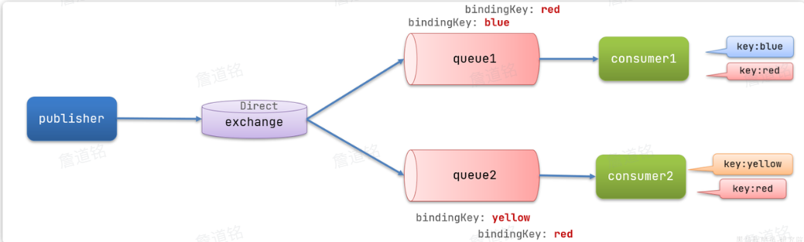

## RabbitMQ 

*高性能的异步通讯组件*


### 一、初识MQ


#### 1. 同步调用


- **同步调用的优势**
  - 时效性强，等待到结果后才返回
- **同步调用的问题**
  - 拓展性差
  - 性能下降
  - 级联失败问题


#### 2. 异步调用


- 异步调用通常是基于消息通知的方式，包含三个角色：
  - **消息发送者**：投递消息的人，就是原来的**调用者**
  - **消息接收者**：接收和处理消息的人，就是原来的**服务提供者**
  - **消息代理**：管理、暂存、转发消息，你可以把它理解成微信服务器
- 异步调用的**优势**
  - 耦合度低，扩展性强
  - 异步调用，无需等待，性能好
  - 故障隔离，下游服务故障不影响上游业务
  - 缓存消息，流量削峰填谷
- 异步调用的**问题**
  - 不能立即得到调用结果，时效性差
  - 不确定下游业务执行是否成功
  - 业务安全依赖于Broker的可靠性


#### 3. 技术选型


- MQ(MessageQueue)，消息队列，存放信息的队列，也就是异步调用中的Broker
- 


### 二、RabbitMQ


#### 1. 安装部署


- **基本介绍**
- RabbitMQ的整体架构和核心概念
- 


#### 2. 快速入门


- **消息发送的注意事项有哪些？**
  - 交换机只能路由消息，无法存储消息
  - 交换机只会路由消息给与其绑定的队列，因此队列必须与交换机绑定。


#### 3. 数据隔离


#### 4. Java客户端

- **快速入门**
- **SpringAMQP如何收发消息**
  - 引入spring-boot-starter-amqp依赖
  - 配置rabbitmq服务端消息
  - 利用RabbitTemplate发送消息
  - 利用@RabbitListener注解声明要监听的队列，监听消息


- **WorkQueues模型**
- 让多个消费者绑定到一个队列共同消费队列中的消息，大大提高消息处理的速度
- 
- 特点：
  - 消息平均分配给每个消费者，并没有考虑到消费者的处理能力。
  - **能者多劳**：在spring中添加以下配置，充分利用每一个消费者的处理能力，可以有效避免消息积压问题。
``` yml
spring:
  rabbitmq:
    listener:
      simple:
        prefetch: 1 # 每次只能获取一条消息，处理完成才能获取下一个消息
```
- **总结**
  - work模型的使用
    - 多个消费者绑定到一个队列，同一条消息只会被一个消费者处理
    - 通过设置prefetch来控制消费者预取的消息数量
  

- **带交换机的模型**
- **Publisher**：生产者，不在发送消息到队列中
- **Exchange**：交换机，一方面，接收生产者发送的消息。另一方面，知道如何处理消息，例如递交给某个特别队列、递交给所有队列、或是将消息丢弃。操作取决于Exchange的类型
- **Queue**：消息队列，接收消息、缓存消息。队列一定要与交换机绑定
- **Consumer**：消费者，订阅队列。
- **交换机只负责转发消息，不具备存储消息的能力**
- 


- **交换机的类型**
- **Fanout**：广播，将消息交给所有绑定到交换机的队列。
- **Direct**：订阅，基于RoutingKey(路由key)发送给订阅了消息的队列
- **Topic**：通配符订阅，与Direct类似，只不过RoutingKey可以使用通配符
- **Headers**：头匹配，基于MQ的消息头匹配，用的较少


- **Fanout交换机**
- 广播模式下消息发送的流程
  - 可以有多个队列
  - 每个队列都要绑定到Exchange(交换机)
  - 生产者发送的消息，只能发送到交换机
  - 交换机把消息发送给绑定过的所有队列
  - 订阅队列的消费者都能拿到消息
- 


- **总结**
- **交换机的作用是什么**
- 接收publisher发送的消息
- 将消息按照规则路由到与之绑定的队列
- 不能缓存消息，路由失败，消息丢失
- FanoutExchange的会将消息路由到每个绑定的队列


- **Direct交换机**
- 队列与交换机的绑定不能是任意绑定，而是要指定一个RoutingKey(路由key)
- 消息的发送方在像Exchange发送消息时，也必须指定消息的RoutingKey
- Exchange不再把消息交给每一个绑定的队列，而是根据消息的RoutingKey进行判断，只有队列的Routingkey与消息的Routingkey完全一致，才会接受到消息
- 


- **总结**
- **描述下Direct交换机与Fanout交换机的差异？**
  - Fanout交换机将消息路由给每一个与之绑定的队列
  - Direct交换机根据RoutingKey判断路由给哪个队列
  - 如果多个队列具有相同的RoutingKey，则与Fanout功能类似


- **Topic交换机**
- Topic类型的Exchange可以让队列在绑定BindingKey的时候使用通配符
- BindingKey一般都是由一个或多个单词组成，多个单词之间以.分割，例如：item.insert
- 通配符规则
  - #：匹配一个或多个词(这个包括后面的所有词)
  - *：匹配不多不少恰好1个词(只能是这个词)
- 


- **总结**
- **描述下Direct交换机与Topic交换机的差异**
  - Topic交换机接收的消息RoutingKey可以是多个单词，以.分割
  - Topic交换机与队列绑定时的bindingKey可以指定通配符
  - #：代表0个或多个词
  - *：代表1个词


- **声明队列和交换机**
- SpringAMQP提供了基本的API
- Queue类
- Exchange接口
- ExchangeBuilder
- QueueBuilder

- 绑定多个key，以direct为例
- **基于注解声明**
- 只需要在listener上的RabbitListner加一下注解即可完成声明和绑定队列和交换机

``` java
@RabbitListener(bindings = @QueueBinding(
    value = @Queue(name = "topic.queue1"),
    exchange = @Exchange(name = "hmall.topic", type = ExchangeTypes.TOPIC),
    key = "china.#"
))
public void listenTopicQueue1(String msg){
    System.out.println("消费者1接收到topic.queue1的消息：【" + msg + "】");
}
```


- **消息转换器**
- Spring的消息发送代码接受的消息体是一个Object，而在数据传输时，他会把你发送的消息序列化为字节发送给MQ，接受消息时，还会把字节给反序列化为Java对象。
- 只不过，默认情况下Spring采用的序列化方法是JDK序列化。众所周知，JDK序列化存在以下问题
  - 数据体积过大
  - 有安全漏洞
  - 可读性差

- 配置JSON转换器
``` xml
<dependency>
    <groupId>com.fasterxml.jackson.dataformat</groupId>
    <artifactId>jackson-dataformat-xml</artifactId>
    <version>2.9.10</version>
</dependency>
```
- 注：如果项目中引入了spring-boot-starter-web依赖则无需再次引入Jackson依赖
- 在服务的情动类中添加一个配置消息转换器的Bean

``` java
@Bean
public MessageConverter messageConverter(){
    // 1.定义消息转换器
    Jackson2JsonMessageConverter jackson2JsonMessageConverter = new Jackson2JsonMessageConverter();
    // 2.配置自动创建消息id，用于识别不同消息，也可以在业务中基于ID判断是否是重复消息
    jackson2JsonMessageConverter.setCreateMessageIds(true);
    return jackson2JsonMessageConverter;
}
```