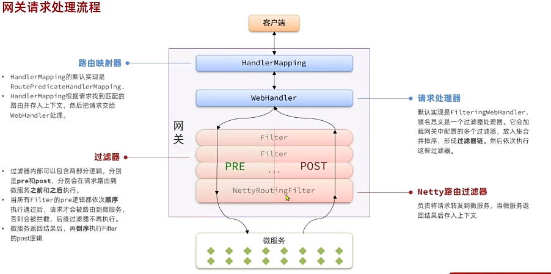
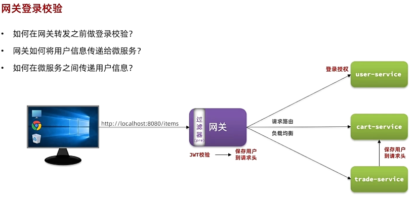
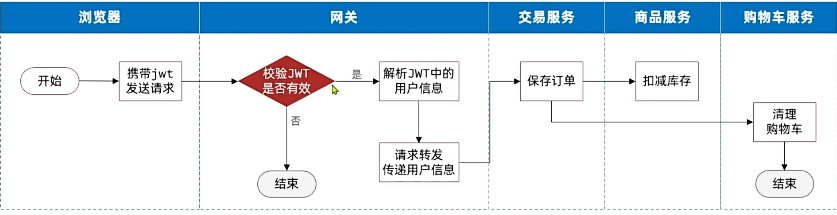
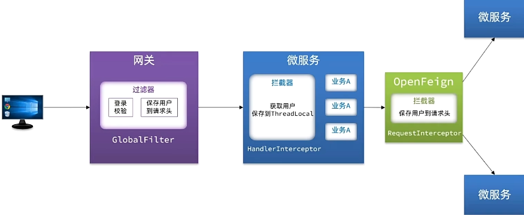
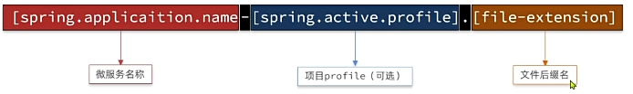
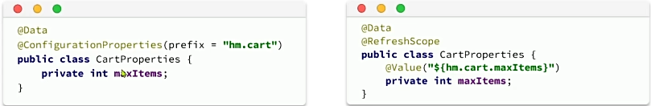
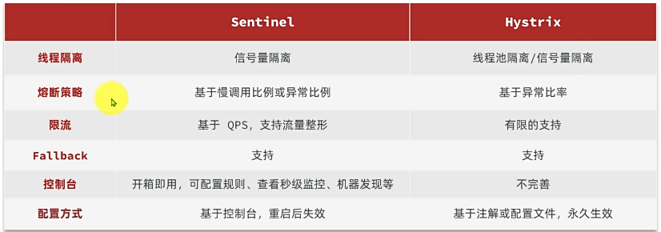
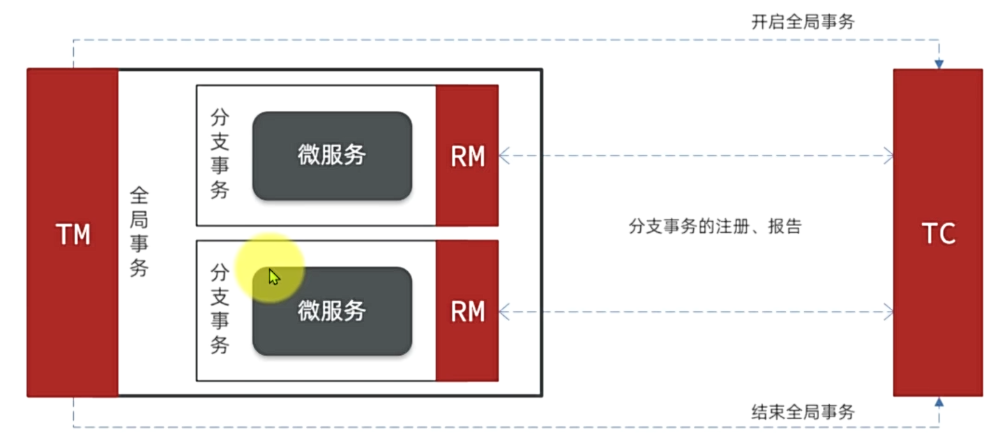
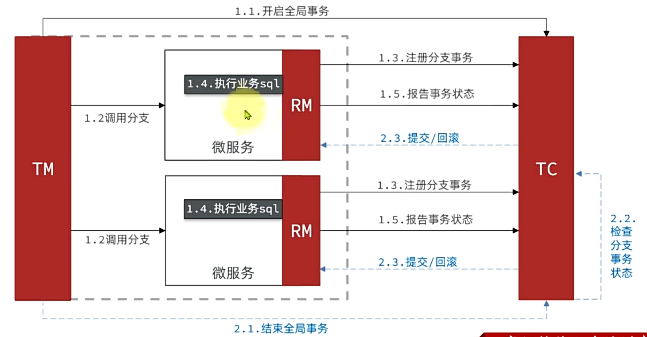
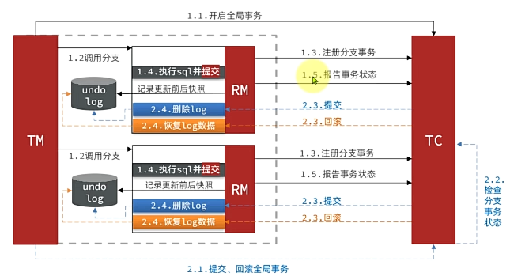

## SpringCloud 微服务


### 一、认识微服务


#### 1. 单体架构


- **单体架构(monolithic structure)**：将整个项目中所有功能模块都在一个工程中开发；项目部署时需要对所有模块一起编译、打包；项目的架构设计、开发模式都非常简单
- 
- 优点：
  - 架构简单
  - 部署成本低
- 缺点：
  - 团队协作成本高
  - 系统发布效率低
  - 系统可用性差：单体架构各个功能模块是作为一个服务部署
- 总结：适合开发功能相对简单、规模较小的项目，相互之间会互相影响，一些热点功能会耗尽系统资源，导致其它服务低可用。


#### 2. 微服务


- **微服务架构**：是服务化思想指导下的一套最佳实践架构方案。服务化，就是把单体架构中的功能模块拆分为多个独立项目。
  - 粒度小
  - 团队自治
  - 服务自治


#### 3. SpringCloud


- **nginx相关命令**
  - **启动nginx**：start nginx.exe
  - **停止**：nginx.exe -s stop
  - **重新加载配置**：nginx.exe -s reload
  - **重启**：nginx.exe -s restart

### 二、微服务拆分


#### 1. 服务拆分原则


- **什么时候拆分**
  - **创业型项目**：先采用单体架构，快速开发，快速试错。随着规模扩大，逐渐拆分。
  - **确定的大型项目**：资金充足，目标明确，可以直接选择微服务架构，避免后续拆分的麻烦。
- **拆分目标**：
  - **高内聚**：每个微服务的职责尽量单一，包含的业务相互关联度高，完整度高
  - **低耦合**：每个微服务的功能要相对独立，尽量减少对其它微服务的依赖
- **拆分方式**
  - **纵向拆分**：按照业务模块进行拆分
  - **横向拆分**：抽取公共服务，提高复用性


#### 2. 微服务项目结构说明


- **工程结构的分类**
  - **完全解耦（独立project）**：每一个微服务都创建为一个独立的工程，甚至可以使用不同的开发语言来开发，项目完全解耦。
    - **优点**：服务之间耦合度低
    - **缺点**：每个项目都有自己的独立仓库，管理起来比较麻烦
  - **Maven聚合**：整个项目为一个Project，然后每个微服务是其中的一个Module
    - **优点**：项目代码集中，管理和运维方便
    - **缺点**：服务之间耦合，编译时间较长


#### 3. 远程调用


- **跨微服务的远程调用（Remote Produce Call，RPC）**
- **RestTemplate**：Spring提供的一个方便实现Http请求的发送的API。但配置不支持并发修改。
  - 1. 注入RestTemplate到Spring容器
  - 2. 发起远程调用

``` java
@Bean
public RestTemplate restTemplate(){
    return new RestTemplate();
}

public <T> ResponseEntity<T> exghange(
    String url，//请求路径
    HttpMethodmethod，//请求方式
    @NullableHttpEntity<?>requestEntity，//请求实体，可以为空
    Class<T>responseType，//返回值类型
    Map<String，?>urivariables//请求参数
)
```

#### 4. 服务治理


- **注册中心原理**
- **服务治理的三个角色**：
  - **服务提供者**：暴露服务接口，供其他服务调用
  - **服务消费者**：调用其他服务提供的接口
  - **注册中心**：记录并监控微服务各实例状态，推送服务变更信息
- **消费者如何知道提供者的地址**
  - 服务提供者在启动时注册自己信息到注册中心，消费者可以从注册中心订阅和拉取服务信息
- **消费者如何得知服务状态变更**
  - 服务提供者通过**心跳机制**向注册中心报告自己的健康状态，当心跳异常时注册中心会将异常服务剔除，并通过订阅了该服务的消费者。
- **当提供者有多个实例时，消费者该选择哪一个**
  - 消费者可以通过**负载均衡**算法，从多个实例中选择一个


- **Nacos注册中心**
- **服务注册**
  - **步骤**
    - 引入nacos discovery依赖
    - 配置Nacos地址


``` xml

<!--nacos 服务注册发现-->
<dependency>
    <groupId>com.alibaba.cloud</groupId>
    <artifactId>spring-cloud-starter-alibaba-nacos-discovery</artifactId>
</dependency>

```

``` yml
spring:
  application:
    name: item-service # 服务名称
  cloud:
    nacos:
      server-addr: 192.168.8.133:8848 # nacos地址
```

- **服务发现**
- 消费者需要连接nacos以拉取和订阅服务，因此服务发现的前两步与服务注册是一样的，后面再加上服务调用即可
  - 引入nacos discovery依赖
  - 配置nacos地址
  - 服务发现

``` xml
<!--nacos 服务注册发现-->
<dependency>
    <groupId>com.alibaba.cloud</groupId>
    <artifactId>spring-cloud-starter-alibaba-nacos-discovery</artifactId>
</dependency>
```

``` yml
spring:
  cloud:
    nacos:
      server-addr: 192.168.150.101:8848
```


#### 5. OpenFeign


- **快速入门**
  - 一个声明式的http客户端，作用是基于SpringMVC的常见注解，实现http请求的发送。
  - http请求的步骤
    - **服务名称**：根据服务名称才能拉取服务的实例列表
    - **请求方式和路径**：通过请求方式和路径确定要请求的资源地址，访问到对应的接口
    - **返回值类型**：知道了返回值类型，才能将接收到的JSON结果处理为对应的JAVA实体
    - **请求参数**：请求参数，是调用接口必不可少的要素
  - 配置步骤：
    - 1. 引入依赖，包括OpenFeign和负载均衡组件SpringCloudLoadBalancer
    - 2. 通过@EnableFeignClients注解，启用OpenFeign功能
- **连接池**：对Http请求进行包装，不过其底层发起http请求，依赖于其他框架，包括
  - **HttpURLConnection**:默认实现，不支持连接池
  - **ApacheHttpClient**:支持连接池
  - **OKHttp**:支持连接池
- 步骤
  - 引入依赖
  - 开启连接池功能
- **最佳实践**：当定义的FeignClient不在SpringBootApplication的扫描包范围时，这些FeignClient无法使用。有两种方式解决：
  - 1. 指定FeignClient所在包
  - 2. 指定FeignClient字节码
- **日志**：OpenFeign只会在FeignClient所在包的日志级别为**DEBUG**时，才会输出日志，而且其日志级别有4级：
  - **NONE**:不记录任何日志信息，这是默认值
  - **BASIC**:仅记录请求的方法，URL以及响应状态码和执行时间
  - **HEADERS**:在BASIC的基础上，额外记录了请求和相应的头信息
  - **FULL**:记录所有请求和响应的明细，包括头信息、请求体、元数据。
  - 要自定义日志级别则需要声明一个类型为Logger.Level的Bean，其中定义日志级别；但此时这个Bean并未生效，想要配置某个FeignClient的日志，可以在@FeignClient注解中声明;如果想要**全局配置**，让所有FeignClient都按照这个日志配置，则需要在@EnableFeignClients注解中声明


``` xml
  <!--openFeign-->
  <dependency>
      <groupId>org.springframework.cloud</groupId>
      <artifactId>spring-cloud-starter-openfeign</artifactId>
  </dependency>
  <!--负载均衡器-->
  <dependency>
      <groupId>org.springframework.cloud</groupId>
      <artifactId>spring-cloud-starter-loadbalancer</artifactId>
  </dependency>
```


``` java
@EnableFeignClients
@SpringBootApplication
public class CartApplication {}
```

``` xml
<!--ok-http-->
<dependency>
    <groupId>io.github.openfeign</groupId>
    <artifactId>feign-okhttp</artifactId>
</dependency>
```

``` yaml
feign:
  okhttp:
    enabled：true #开启OKHttp连接池支持
```

``` java
@EnableFeignClients = (basePackages"com.hmall.api.client")

@EnableFeignClients(clients = {UserClient.class})
```

``` java
public class DefaultFeignConfig {
  @Bean
  public Logger.Level feignLoglevel(){
    return Logger.Level.FULL;
  }
}

@FeignClient(value = "item-service",configuration = DefaultFeignConfig.class)

@EnableFeignClients(defaultConfiguration = DefaultFeignConfig.class)
```
- **总结**
  - **如何利用OpenFeign实现远程调用**
    - 引入OpenFeign和SpringCloudLoadBalancer依赖
    - 利用@EnableFeignClients注解开启OpenFeign功能
    - 编写FeignClient
  - **如何配置OpenFeign的连接池**
    - 引入http客户端依赖，例如OKHttp、HttpClient
    - 配置yaml文件，打开OpenFeign连接池开关
  - **OpenFeign使用的最佳实践方式是什么**
    - 由服务提供者编写独立module，将FeignCient及DTO抽取
  - **如何配置OpenFeign输出日志的级别**
    - 声明类型为Logger.Level的Bean
    - 在@FeignClient或@EnableFeignClients注解上使用


### 三、网关


#### 1. 什么是网关


- **网关**：网络的关口，负责请求的路由、转发、身份校验
  - 网关可以做安全控制，也就是登陆身份校验，检验通过才放行
  - 通过认证后，网管再根据请求判断应该访问哪个微服务，将请求转发过去
- **SpringCloud Gateway**
  - 创建新模块
  - 引入网关依赖
  - 编写启动类
  - 配置路由规则


``` yaml
server:
  port: 8080
spring:
  application:
    name: gateway
  cloud:
    nacos:
      server-addr: 192.168.150.101:8848
    gateway:
      routes:
        - id: item # 路由规则id，自定义，唯一
          uri: lb://item-service # 路由的目标服务，lb代表负载均衡，会从注册中心拉取服务列表
          predicates: # 路由断言，判断当前请求是否符合当前规则，符合则路由到目标服务
            - Path=/items/**,/search/** # 这里是以请求路径作为判断规则
        - id: cart
          uri: lb://cart-service
          predicates:
            - Path=/carts/**
        - id: user
          uri: lb://user-service
          predicates:
            - Path=/users/**,/addresses/**
        - id: trade
          uri: lb://trade-service
          predicates:
            - Path=/orders/**
        - id: pay
          uri: lb://pay-service
          predicates:
            - Path=/pay-orders/**

```

- **路由属性**
- 网关路由对应的Java类型是RouteDefinition，其中常见的属性有：
  - id：路由唯一标示
  - uri：路由目标地址
  - predicates：路由断言，判断请求是否符合当前路由
  - filters：路由过滤器，对请求或响应做特殊处理
- **路由断言**
  - 名称：说明
  - **After**:是某个时间点后的请求
  - **Before**:是某个时间点之前的请求
  - **Between**:是某两个时间点之前的请求
  - **Cookie**:请求必须包含某些cookie
  - **Header**:请求必须包含某些header
  - **Host**:请求必须是访问某个host（域名）
  - **Method**:请求方式必须是指定方式
  - **Path**:请求路径必须符合指定规则
  - **Query**:请求参数必须包含指定参数
  - **RemoteAddr**:请求者的ip必须是指定范围
  - **weight**:权重处理
- **路由过滤器**
  - **AddRequestHeader**：给当前请求添加一个请求头；AddrequestHeader=headerName,headerValue
  - **RemoveRequestHeader**：移除请求中的一个请求头；RemoveRequestHeader=headerName
  - **AddResponseHeader**：给响应结果中添加一个响应头；AddResponseHeader=headerName,headerValue
  - **RemoveResponseHeader**：从响应结果中移除一个响应头；RemoveResponseHeader=headerName
  - **RewritePath**：请求路径重写；"RewritePath=/red/?(?<segment>.*)，/$\\{segment}"
  - **StripPrefix**：去除请求路径中的N段前缀;StripPrefix=1，则路径/a/b转发时只保留/b


#### 2. 网关登录校验


- **网关请求处理流程**
  - **路由映射器**：HandlerMapping的默认实现是RoutePredicateHandlerMapping；HandlerMapping根据请求找到匹配的路由并存入上下文，然后把请求交给WebHandler处理。
  - **请求处理器**：默认实现是FilteringWebHandler，顾名思义是一个过滤器处理器。它会加载网关中配置的多个过滤器，放入集合并排序，形成过滤器链。然后依次执行这些过滤器。
  - **Netty路由过滤器**：负责将请求转发到微服务，当微服务返回结果后存入上下文
  - **过滤器**：过滤器内部可以包含两部分逻辑，分别是pre和post，分别会在请求路由到微服务之前和之后执行。当所有Filter的pre逻辑都依次顺序执行通过后，请求才会被路由到微服务，否则会被拦截，后续过滤器不再执行。微服务返回结果后，再倒序执行Filter的post逻辑。





- **如何在网关之前做登录校验？**
- **网关如何将用户信息传递给微服务？**
- **如何在微服务之间传递用户信息？**





- **自定义过滤器**
  - **GatewayFilter**：路由过滤器，作用于任意指定的路由；默认不生效，要配置到路由后生效。
  - **GlobalFilter**：全局过滤器，作用范围是所有路由；声明后自动生效。

- **实现登录校验**：
- **antPathMatcher**:用于对带**的通配符的路径的比较。

- **网关传递用户到微服务**
- 1. 在网关的登录校验过滤器中，把获取到的用户写入请求头：使用mutate()//对下游请求做更改
- 2. 在hm-common中编写SpringMVC拦截器，获取登录用户


- **OpenFeign传递用户**：微服务项目中的很多业务需要多个微服务共同完成，而这个过程中也需要传递登陆用户信息，例如：
- OpenFeign中提供了一个拦截器接口，所有由OpenFeign发起的请求都会先调用拦截器处理请求


- **总结：微服务登陆解决方案**
- 


#### 3. 配置管理


- **配置管理目前出现的问题**
  - 1. 微服务内部非常多的配置文件且重复。操作麻烦，维护成本高
  - 解决方案：引入配置管理服务，微服务从中读取定义好的配置。修改在配置管理服务中修改。
  - 2. 业务配置太多，如登录模块和网关模块，涉及的配置太多，涉及到写死的网关路由配置变更要重启网关。
  - 解决方案：配置管理服务可以通过推送配置变更来实现配置变更热更新。
- Nacos不仅是注册中心，还提供了配置管理服务。


- **共享配置**
- **步骤**
  - 1. 添加一些共享配置到Nacos中，包括：jdbc,MybatisPlus,日志，Swagger，OpenFeign等配置
  - 2. 拉取共享配置：基于NacosConfig拉取共享配置代替微服务的本地配置
      - 引入依赖nacos-config
      - 新建bootstrap.yaml


- **配置热更新**
- 当修改配置文件中的配置时，微服务无需重启即可使配置生效
- **前提条件**
  - 1. nacos中要有一个与微服务名有关的配置文件，例如:
  - 2. 微服务中要以特定方式读取需要热更新的配置属性，例如：


- **动态路由**
  - 实现：首先将路由配置保存到Nacos，当Nacos中的路由配置变更时，推送最新配置到网关，实时更新网关中的路由信息。
    - 监听Nacos配置变更的信息
    - 当配置变更时，将最新的路由信息更新到网关路由表
- 希望Nacos推送配置变更，可以使用Nacos动态监听配置接口来实现

``` java
public void addListener(String dataId, String group, Listener listener)
```

- 请求参数说明：
- **dataId**：**string**:配置 ID，保证全局唯一性，只允许英文字符和 4 种特殊字符（"."、":"、"-"、"_"）。不超过 256 字节。
- **group**：**string**:配置分组，一般是默认的DEFAULT_GROUP。
- **listener**：**Listener**:监听器，配置变更进入监听器的回调函数。


- **更新路由表**：监听到路由信息后，可以利用RouteDefinitionWriter来更新路由表


### 四、服务保护和分布式事务


#### 1. 雪崩问题


- **产生原因**：
  - 微服务相互调用，服务提供者出现故障或阻塞
  - 服务调用者没有做好异常处理，导致自身故障
  - 调用链中的所有服务级联失败，导致整个集群故障
- **解决问题的思路**：
  - 尽量避免服务出现故障或阻塞
    - 保障代码的健壮性
    - 保证网络畅通
    - 能应对较高的并发请求
  - 服务调用者做好远程调用异常的后备方案，避免故障扩散
- **解决方案**
  - **请求限流**：限制访问微服务请求的并发量，避免服务因流量激增出现故障。
  - **线程隔离**：也叫舱壁模式，模拟船舱隔板的防水原理。通过限定每个业务能使用的线程数量而将故障业务隔离，避免故障扩散。
  - **服务熔断**：由断路器统计请求的异常比例或慢调用比例，如果超出阈值则会熔断该业务，则拦截该接口的请求。熔断期间，所有请求快速失败，全都走fallback逻辑。
  - **失败处理**：定义fallback逻辑，让业务失败时不再抛出异常，而是返回默认数据或友好提示。
- **服务保护技术**
  - **Sentinel**
  - **Hystrix**


- **Sentinel**
- **簇点链路**：即单机调用链路，是一次请求进入服务后经过的每一个被Sentinel监控的资源链。默认Sentinel会监控SpingMVC的每一个Endpoint(http接口)。限流、熔断等都是针对簇点链路中的资源设置的。而资源名默认就是接口的请求路径。
- Restful风格的API请求路径一般都相同，这会导致簇点资源名称重复。因此我们要修改配置，把请求方式+请求路径作为簇点资源名称
- **请求限流**：在簇点链路后面点击流控按钮，即可对其做限流配置
- **线程隔离**：当商品服务出现阻塞或故障时，调用商品服务的购物车服务可能因此而被拖慢，甚至资源耗尽。所以必须限制购物车服务中查询商品这个业务的可用线程数，实现线程隔离
- **Fallback**：
  - 将FeignClient作为Sentinel的簇点资源
  - FeignClient的Fallback有两种配置方式：
    - 方式一：FallbackClass，无法对远程调用的异常做处理
    - 方式二：FallbackFactory，可以对远程调用的异常做处理，通常都会选择这种
- **服务熔断**：熔断降级是解决雪崩问题的重要手段。思路是由断路器统计服务调用的异常比例、慢请求比例，如果超出阈值则会熔断该服务。即拦截访问该服务的一切请求；当服务恢复时，断路器会放行访问该服务的请求。


#### 2. 分布式事务


- **分布式事务**：在分布式系统中，如果一个业务需要多个服务合作完成，而且每一个服务都有事务，多个事务必须同时成功或失败，这样的事务就是分布式事务。其中的每个服务的事务就是一个**分支事务**，整个业务称为**全局事务**。


- **初识Seata**
- 分布式事务解决思路：各个子事务之间必须能感知彼此的事务状态，才能保证状态一致。**事务协调者**
- **Seata架构**
  - **TC(Transaction Coordinator) - 事务协调者**：维护全局和分支事务的状态，协调全局事务提交或回滚。
  - **TM(Transaction Manager) - 事务管理器**：定义全局事务的范围，开始全局事务、提交或回滚全局事务。
  - **RM(Resource Manager) - 资源管理器**：管理分支事务，与TC交谈以注册分支事务和报告分支事务的状态。
- 
- **XA模式**
  - XA规范是X/Open组织定义的分布式事务处理(DTP,Distributed Transaction Processing)标准，XA规范描述了全局的TM与局部的RM之间的接口，几乎所有主流的关系型数据库都对XA规范提供了支持。Seata的XA模式如下：
  - 
  - 一阶段的工作：
    - RM注册分支事务到TC
    - RM执行分支业务sql但**不提交**
    - RM报告执行状态到TC
  - 二阶段的工作
    - TC检测各分支事务执行状态
      - 如果都成功，通知所有RM提交事务
      - 如果有失败，通知所有RM回滚事务
    - RM接收TC指令，提交或回滚事务
  - **优点**：
    - 事务的**强一致性**，满足ACID原则。
    - 常用数据库都支持，**实现简单**，并且没有代码侵入
  - **缺点**：
    - 因为一阶段需要**锁定数据库资源**，等待二阶段结束才释放，**性能较差**
    - 依赖**关系型数据库**实现事务
  - 实现XA模式
    - 修改application.yml文件(每个参与事务的微服务)，开启XA模式
    - 给发起全局事务的入口方法添加@GlobalTransactional注解，本例中是OrderServiceImpl的create方法
    - 重启服务并测试

``` yaml
seata:
  data-source-proxy-mode: XA
```


- **AT模式**
- AT模式同样是分阶段提交的事务模型，不过弥补了XA模型中资源锁定周期过长的缺陷。
- 
- 阶段一RM的工作：
  - 注册分支事务
  - 记录undo-log（数据快照）
  - 执行业务sql并提交
  - 报告事务状态
- 二阶段提交时RM的工作
  - 删除undo-log即可
- 二阶段回滚时RM的工作：
  - 根据undo-log恢复数据到更新前

- **简述AT模式与XA模式最大的区别是什么**
- XA模式一阶段不提交事务，锁定资源；AT模式一阶段直接提交，不锁定资源
- XA模式依赖数据库机制实现回滚；AT模式利用数据快照实现数据回滚
- XA模式强一致；AT模式最终一致